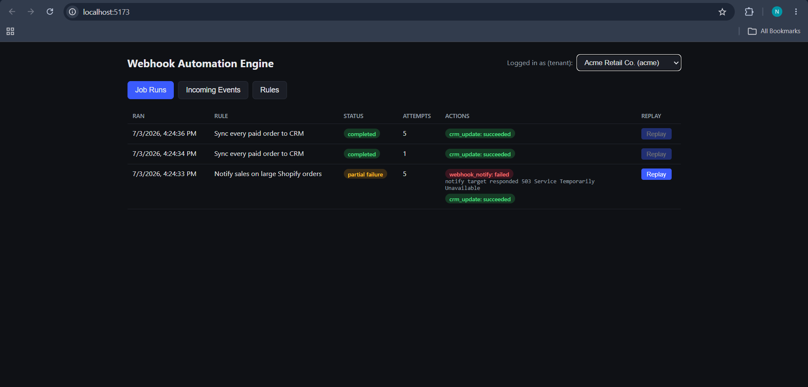
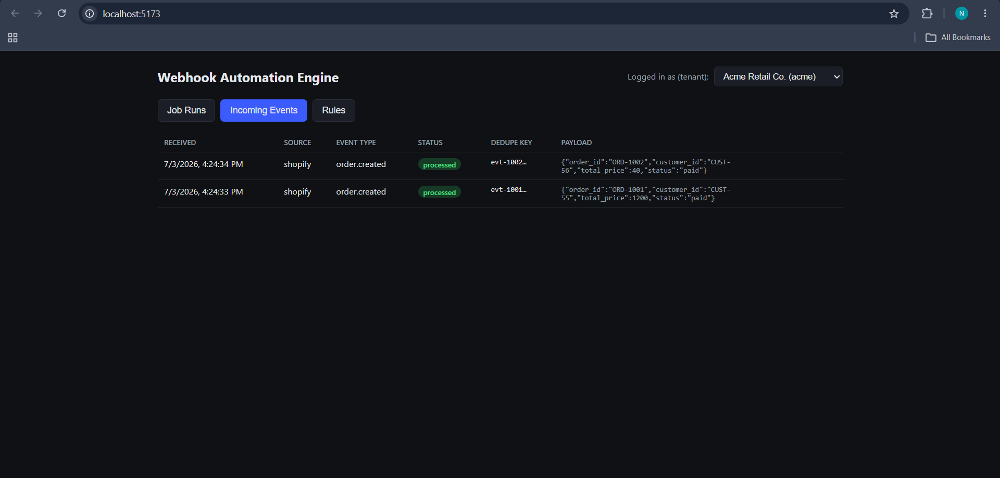
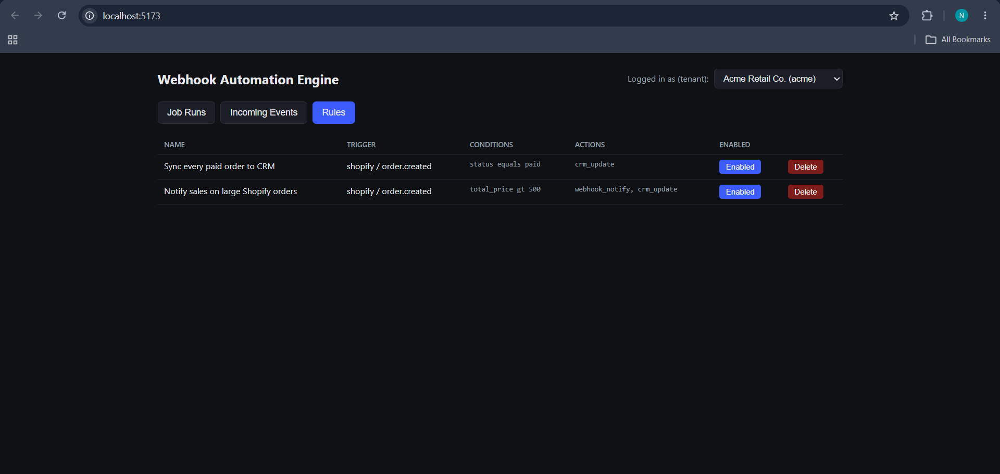

# Webhook Automation Engine

An asynchronous, multi-tenant webhook automation engine built with **NestJS**, **BullMQ**, **MongoDB**, **Redis**, and **React**.

This project demonstrates reliable webhook ingestion, asynchronous rule execution, deduplication, failure recovery, replay support, and tenant isolation.

---

## Features

- Multi-tenant webhook ingestion
- HMAC signature verification
- Idempotent webhook processing
- Asynchronous job processing with BullMQ
- Rule-based automation engine
- Job status tracking and replay
- Failure recovery and retry support
- Simple dashboard for monitoring events, jobs, and rules

---

## Tech Stack

| Layer            | Technology     |
| ---------------- | -------------- |
| Backend          | NestJS         |
| Frontend         | React (Vite)   |
| Database         | MongoDB        |
| Queue            | BullMQ + Redis |
| Containerization | Docker         |

---

## Dashboard

The application provides a simple multi-tenant dashboard to monitor incoming webhook events, automation rules, job execution status, and replay failed jobs.

### Job Runs

<p align="center">
  
</p>

### Incoming Events

<p align="center">
  
</p>

### Rules

<p align="center">
  
</p>

---

## Project Structure

```text
backend/
frontend/
sample-data/
assets/
docker-compose.yml
README.md
```

---

## Getting Started

### 1. Clone the repository

```bash
git clone https://github.com/Nishantdubey7/webhook-automation-engine.git
cd webhook-automation-engine
```

### 2. Start the application

```bash
docker compose up --build
```

This starts:

- Backend: http://localhost:3000
- Frontend: http://localhost:5173
- MongoDB
- Redis

### 3. Seed the database

```bash
docker exec -it webhook-backend-1 npm run seed
```

This creates demo tenants and automation rules.

### 4. Simulate incoming webhooks

```bash
node sample-data/send-sample-webhooks.js
```

The script demonstrates:

- Successful webhook processing
- Duplicate webhook detection
- Invalid signature rejection
- Multi-tenant webhook handling

---

## Environment Variables

Create a `.env` file using the provided `.env.example`.

```env
PORT=3000
MONGO_URI=mongodb://mongo:27017/webhook_engine
REDIS_HOST=redis
REDIS_PORT=6379
DEFAULT_WEBHOOK_SECRET=dev-secret-change-me
```

---

## Data Model

The application uses four primary collections:

- **Tenant** – Stores tenant information and webhook signing secrets.
- **WebhookEvent** – Stores incoming webhook payloads for auditing, deduplication, and replay.
- **Rule** – Defines automation triggers, conditions, and actions.
- **JobRun** – Stores execution history, retry attempts, failures, and replay information.

This separation keeps ingestion, rule configuration, and execution history independent while ensuring complete tenant isolation.

---

## Queue Design

After validating a webhook, the API immediately stores the event and acknowledges the request.

Only the event ID is pushed to BullMQ.

The worker then:

1. Loads the event
2. Finds matching automation rules
3. Evaluates rule conditions
4. Executes configured actions
5. Records execution results in a JobRun document

If processing fails, BullMQ retries the job automatically.

Previously completed actions are skipped during replay, ensuring idempotent execution.

---

## Simulating Incoming Webhooks

Run:

```bash
node sample-data/send-sample-webhooks.js
```

The script sends:

- A valid webhook
- A duplicate webhook
- A webhook with an invalid signature
- A webhook for another tenant

---

## Triggering Failure and Replay

The sample workflow intentionally includes a simulated downstream failure.

To replay a failed job:

1. Open the dashboard.
2. Navigate to **Job Runs**.
3. Click **Replay** on the failed job.

Only failed actions are executed again.

---

## Scaling Considerations

For a tenant processing approximately **500,000 orders/day** (around **1.5 million webhook events/day**), the primary bottleneck is external action execution rather than MongoDB or Redis.

The system can scale by:

- Running multiple BullMQ worker instances
- Processing independent actions concurrently
- Separating slow actions into dedicated queues
- Scaling workers independently from the API
- Keeping webhook ingestion lightweight while workers handle processing

---

## Demo

The sample workflow demonstrates:

- Fast webhook acknowledgement
- Asynchronous job processing
- Duplicate webhook detection
- Invalid signature rejection
- Multi-tenant isolation
- Failed job replay

---

## Author

**Nishant Dubey**
